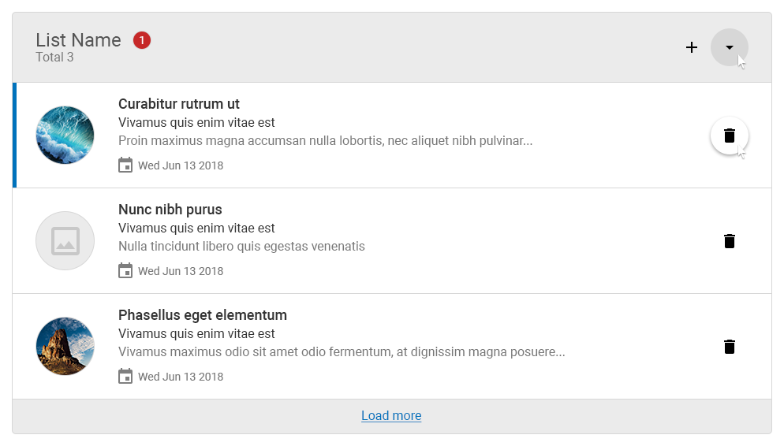
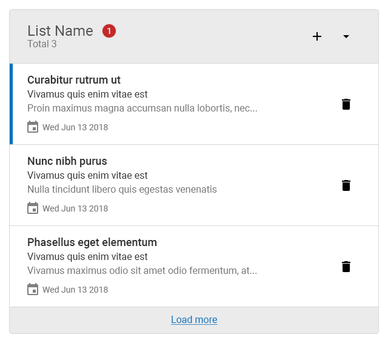

# UI Engineer Coding Scenario

## Getting Started

- Download the repository.
- Install packages and run the project ([Node.js](https://nodejs.org/en/) and [Angular CLI](https://github.com/angular/angular-cli) are required).
```shell
npm install
ng serve
```
- To submit your test, use GitHub to upload your project and email us the link to your repository.

## Coding Scenario

### Using the mock-ups provided, build a mobile first list component as follows:

Do your best to complete as many steps as you can.

1. Using only HTML, create a template for the structure depicted in the mock-ups.
2. Using CSS, style your template so it matches the mock-ups as closely as possible.
3. Create an Angular list component from your code and import it to the project.
4. Display system's current date in the format shown in the mock-ups.
5. Display the total number of items in the list header.
6. Display the total number of new items as red badge in the list header.
7. Display default image placeholder if item is missing icon.

### BONUS:

- Add collapse functionality to the list component.
- Configure the component so it loads hardcoded data object.
- Create functions for Add and Delete buttons.
- Truncate long texts in list items.

### Component behavior:

- New items are indicated by blue border.
- List components can be collapsed by clicking the caret icon. 
- The entire list item including the icon is clickable to open the record.
- The component must be responsive.
- List item icons are hidden in mobile view.

__Note:__ Do NOT use any CSS frameworks or Angular Libraries.

### Desktop


### Mobile
